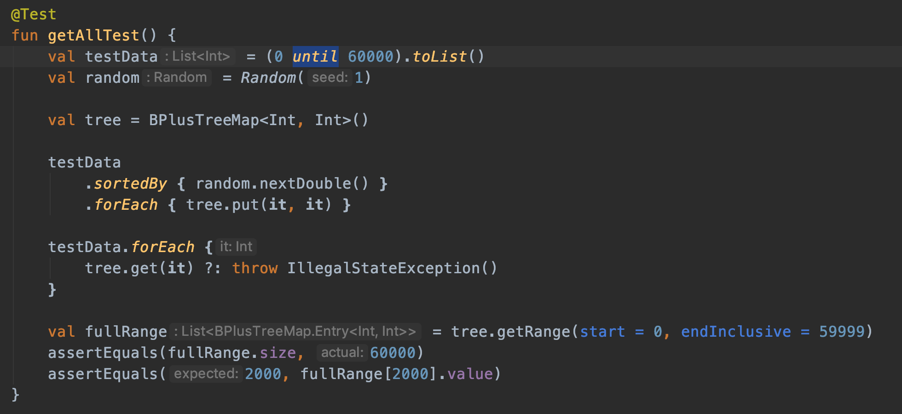

# BPlusTreeMap

In memory B+ Tree
Modified from my original BTreeMap: https://github.com/huntj88/BTreeMap

### Usage
##### `fun put(key: Key, value: Value)`
---
##### `fun get(key: Key): Value?`
##### `fun getRange(start: Key, endInclusive: Key): List<Entry<Key, Value>>`
---

